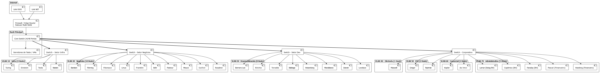

# 🌐 Projeto de Arquitetura e Topologia Lógica de Rede

Este repositório contém a documentação da arquitetura lógica de rede de uma unidade corporativa. O objetivo deste projeto foi evoluir de um mapeamento físico tradicional para uma topologia lógica estruturada, focada em escalabilidade, segurança e gerenciamento eficiente de tráfego.

## 🚀 Estrutura e Arquitetura do Projeto

O diagrama foi reestruturado adotando a cultura de **Infraestrutura como Código (IaC)** utilizando **PlantUML**, permitindo o versionamento contínuo do mapa da rede. Os principais pilares desta arquitetura são:

* **Core & Borda (Edge):** Implementação de um Firewall/Edge Router centralizando a entrada de dados, com redundância de links (Multi-WAN: Vivo e NET) garantindo Alta Disponibilidade (HA).
* **Segmentação Lógica (VLANs):** Substituição do mapeamento puramente geográfico por zonas de segurança lógicas. A rede foi dividida em VLANs dedicadas (Infra, Negócios, Dev, Diretoria, ESG, Comercial e Administrativo) para isolar o tráfego e aumentar a segurança.
* **Hierarquia de Rede:** Estruturação clara do fluxo de dados: Internet -> Firewall -> Core Switch (Rack Principal) -> Switches de Acesso (Setores).
* **Segurança e Anonimato:** Os nomes dos colaboradores (Hosts) foram substituídos por pioneiros da ciência e tecnologia (ex: Newton, Lovelace, Turing) garantindo a privacidade dos dados para exibição em portfólio.

## 🛠️ Ativos Mapeados

* **Borda:** Modems de Operadora (Vivo/NET) e Firewall central.
* **Rack Principal (Core):** Switch Core 24/48 Portas e Servidores de Teste/VMs.
* **Acesso (Layer 2):** Switches departamentais interligando os clusters de usuários.
* **VLANs Mapeadas:**
  * VLAN 10 - Infraestrutura
  * VLAN 20 - Negócios
  * VLAN 30 - Desenvolvimento
  * VLAN 40 - Diretoria
  * VLAN 50 - ESG
  * VLAN 60 - Comercial
  * VLAN 70 - Administrativo

## 📈 Roadmap de Evolução

- [x] Mapeamento Físico e Inventário Visual.
- [x] Migração para Infraestrutura como Código (PlantUML) e Topologia Lógica.
- [x] Segmentação de rede através de VLANs.
- [ ] Definição do plano de Endereçamento IP (Sub-redes e CIDR).
- [ ] Documentação das regras de Firewall (Inbound/Outbound) e Políticas de Roteamento.
